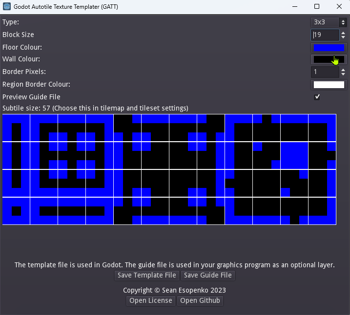

# Godot Autotile Texture Templater (GATT)

The autotile templates provided with the official godot documentation on [Autotiles](https://docs.godotengine.org/en/stable/tutorials/2d/using_tilemaps.html#autotiles) aren't easy to use because the guide lines have been baked into each tile, requiring lots of editing using a graphics program (such as gimp).  Godot Autotile Texture Templater (GATT) solves this problem by generating templates for use in autotiles.

## Download

[Download the releases of the tool from itch.io](https://sesopenko.itch.io/gatt). The windows export is tested but linux is not, ymmv.

## Relevant Documentation

* [Godot Autotiles](https://docs.godotengine.org/en/stable/tutorials/2d/using_tilemaps.html#autotiles)
* [TileSet](https://docs.godotengine.org/en/stable/classes/class_tileset.html)
* [Resources](https://docs.godotengine.org/en/stable/tutorials/scripting/resources.html)
* [ResourceSaver](https://docs.godotengine.org/en/stable/classes/class_resourcesaver.html)

## Tips & Tricks

* Colliders can't be smaller than 1 pixel (even with snap turned off) so avoid generating tilesets with block sizes 2 pixels or smaller if you plan on them colliding with KinematicBody2D nodes.
* Use the recommended subcell size displayed in the tool to make it easy to create your tilesets in Godot.
* The 3/4 view 3x3 tileset technically has the exact same bitmask of the rectangular 3x3.  You can draw the bitmask in the Tileset editor of Godot using the 3x3 (minimal) then swap out the graphic with one generated by 3x3 top down floor.
* When using the 3/4 view tilesets, you can make your player's KinematicBody2D's collider the size of their feet if you'd like the player to overlap the wall slightly, for some fake perspective.  If you do this, draw the collision boundaries of your tiles walls with exposed faces so that the collision shapes cover the tops of the walls, and not the front faces.  This will let the player's body overlap the front facing walls.
* Because each tile consists of 9 tiles and they're all one art asset it's not possible to put your player's feet BEHIND the wall of a 3/4 tile.  Draw your collisions so that the player's feet don't overlap with lower walls.

## Copyright

This software, Godot Autotile Texture Templater (GATT), is copyright (c) Sean Esopenko 2023.

## License: GNU GPL V3

This program is free software: you can redistribute it and/or modify it under the terms of the GNU General Public License as published by the Free Software Foundation, either version 3 of the License, or (at your option) any later version.

This program is distributed in the hope that it will be useful, but WITHOUT ANY WARRANTY; without even the implied warranty of MERCHANTABILITY or FITNESS FOR A PARTICULAR PURPOSE. See the GNU General Public License for more details.

You should have received a copy of the GNU General Public License along with this program as [COPYING.txt](./COPYING.txt). If not, see [https://www.gnu.org/licenses/](https://www.gnu.org/licenses/). 
