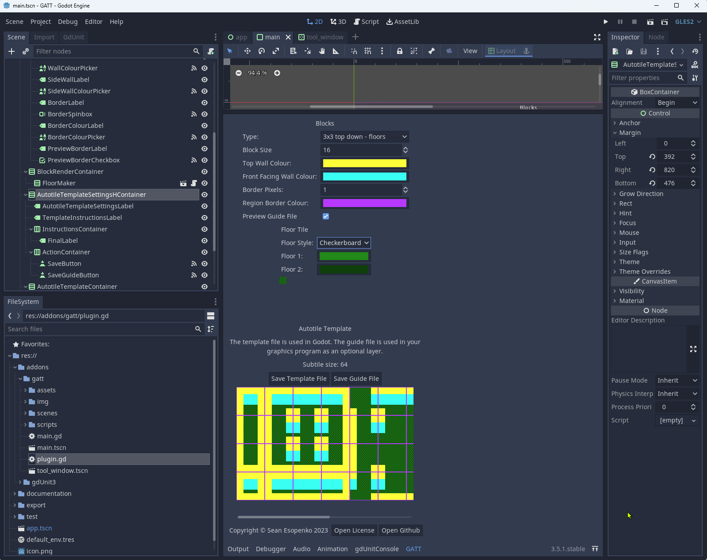

# Godot Autotile Texture Templater (GATT)

GATT - Godot Autotile Texture Templater generates texture templates for use with TileMap [autotiling](https://docs.godotengine.org/en/stable/tutorials/2d/using_tilemaps.html#autotiles).  Adds GATT to your bottom toolbar.  Choose from 2x2, 3x3 minimal and 3x3 minimal 3/4 view tilesets.  Configure a custom block size, colours, and floor patterns. Save 2 different images to your project: a texture which can be used directly in a Tileset plus a guidelines png with transparency which can act as a guide in a layer of your graphics software (ie: gimp).

## Plugin Directions

The plugin appears in the bottom toolbar.

1. Set your desired type, block size, floor style, colours.
2. Click `Save Template File` and choose the location to save the template.
3. Note the `Subtile Size` reported above the save buttons because you'll need to use that in the Tileset editor when defining your autotiles.
4. Set your tileset snap to the `Block Size`.

### Optional: Paint your own using guide

1. Save the Guide File as a separate file.
2. Open the template file with Gimp
3. Open the guide file with Gimp
3. In the Guide file, select all and copy
4. Switch to the template file and paste
5. Choose Layer -> New Layer
6. Alter the transparency of the guide layer to suit your liking
7. Hide the guide layer before exporting your newly painted tiles from Gimp

For more information on autotiles refer to [the documentation](https://docs.godotengine.org/en/stable/tutorials/2d/using_tilemaps.html#autotiles).

## Relevant Documentation

* [Godot Autotiles](https://docs.godotengine.org/en/stable/tutorials/2d/using_tilemaps.html#autotiles)
* [TileSet](https://docs.godotengine.org/en/stable/classes/class_tileset.html)
* [Resources](https://docs.godotengine.org/en/stable/tutorials/scripting/resources.html)
* [ResourceSaver](https://docs.godotengine.org/en/stable/classes/class_resourcesaver.html)

## Tips & Tricks

* Colliders can't be smaller than 1 pixel (even with snap turned off) so avoid generating tilesets with block sizes 2 pixels or smaller if you plan on them colliding with KinematicBody2D nodes.
* Use the recommended subcell size displayed in the tool to make it easy to create your tilesets in Godot.
* The 3/4 view 3x3 tileset technically has the exact same bitmask of the rectangular 3x3.  You can draw the bitmask in the Tileset editor of Godot using the 3x3 (minimal) then swap out the graphic with one generated by 3x3 top down floor.
* When using the 3/4 view tilesets, you can make your player's KinematicBody2D's collider the size of their feet if you'd like the player to overlap the wall slightly, for some fake perspective.  If you do this, draw the collision boundaries of your tiles walls with exposed faces so that the collision shapes cover the tops of the walls, and not the front faces.  This will let the player's body overlap the front facing walls.
* Because each tile consists of 9 tiles and they're all one art asset it's not possible to put your player's feet BEHIND the wall of a 3/4 tile.  Draw your collisions so that the player's feet don't overlap with lower walls.

## Copyright

This software, Godot Autotile Texture Templater (GATT), is copyright (c) Sean Esopenko 2023.

## License

This software is licensed under the MIT license which can be found in [LICENSE.md](./LICENSE.md)
